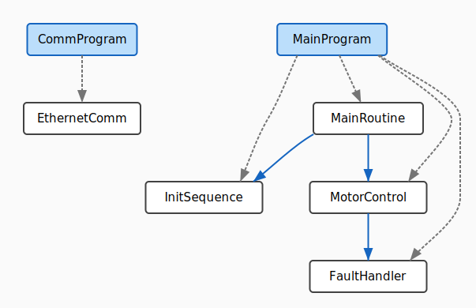

# plcviz

PLC code visualization tool - generate SVG diagrams from L5X (Rockwell) and PLCopen XML (IEC 61131-3) files.

## Example Output



## Features

- **Structure graphs**: Program/POU containment hierarchy
- **Call graphs**: Function/FB call relationships
- **DataType dependency graphs**: UDT nesting relationships (PLCopen)
- **Multiple formats**: L5X (Rockwell) and PLCopen XML (Siemens, CODESYS, Beckhoff, B&R)
- **Multiple export types**: Controller, Program, and AOI exports (L5X)

## Supported Formats

### L5X (Rockwell Automation)
- Logix5000 / Studio 5000 exports (.L5X)
- ControlLogix, CompactLogix, SoftLogix platforms

### PLCopen XML (IEC 61131-3 TC6)
- Siemens TIA Portal
- CODESYS
- Beckhoff TwinCAT
- B&R Automation Studio
- Beremiz
- Any IEC 61131-3 compliant tool

## Installation

### Binary Releases (Recommended)

Download pre-built binaries from [GitHub Releases](https://github.com/radevgit/plc/releases):

**Linux:**
```bash
curl -L https://github.com/radevgit/plc/releases/download/plcviz-v0.3.2/plcviz-v0.3.2-x86_64-linux.tar.gz | tar xz
chmod +x plcviz
sudo mv plcviz /usr/local/bin/
```

**Windows:**
```powershell
# Download from GitHub Releases and extract
# Add to PATH or run from current directory
.\plcviz.exe --version
```

### From Source

Requires Rust 1.70+:

```bash
cargo install --path .
```

## Usage

```bash
# Generate structure graph (default)
plcviz project.L5X > structure.svg
plcviz project.xml > structure.svg  # PLCopen

# Generate call graph
plcviz -t call project.L5X > calls.svg

# Generate combined graph (structure + calls)
plcviz -t combined project.L5X > combined.svg

# DataType dependency graph (PLCopen only)
plcviz -t dataflow project.xml > datatypes.svg

# Include AOIs in the graph (L5X only)
plcviz -a project.L5X > with_aois.svg

# Generate example graph (no file needed)
plcviz example > example.svg
```

## Graph Types

| Type | L5X Support | PLCopen Support | Description |
|------|------------|-----------------|-------------|
| `structure` | ✅ | ✅ | Containment hierarchy (Programs/POUs) |
| `call` | ✅ | ✅ | Function/FB call relationships |
| `dataflow` | ⚠️ (example) | ✅ | Tag relationships / DataType dependencies |
| `combined` | ✅ | ✅ | Structure + call edges |

## Supported Export Types

### L5X
- **Controller**: Full project exports (multiple programs)
- **Program**: Single program exports  
- **AddOnInstructionDefinition**: AOI exports with internal routines

### PLCopen
- **Project**: Full project with POUs (programs, functions, function blocks)
- **DataTypes**: User-defined types and structures

## Format Detection

plcviz automatically detects the file format:
- PLCopen: Detected by `<project xmlns="http://www.plcopen.org/xml/tc6...">` 
- L5X: All other XML files

## License

MIT
